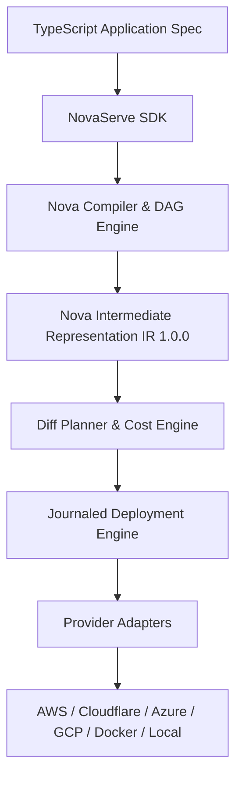

<p align="center">
  
</p>

<h3 align="center">The TypeScript-Native Infrastructure Platform</h3>

<p align="center">
  <strong>Define. Compile. Plan. Deploy.</strong>
</p>

<p align="center">
  Build and manage cloud infrastructure with TypeScript —<br />
  from application definition to provider-specific deployment,<br />
  through a compiler-driven, provider-independent architecture.
</p>

<p align="center">
  <a href="https://www.npmjs.com/package/novaserve"></a>
  <a href="https://www.npmjs.com/package/novaserve"></a>
  <a href="https://github.com/novaserve-cloud/novaserve/blob/main/LICENSE"></a>
  <a href="https://typescriptlang.org"></a>
  <a href="https://nodejs.org"></a>
  <a href="https://github.com/novaserve-cloud/novaserve/actions"></a>
</p>

---

```text
ONE SDK  ──►  ONE COMPILER  ──►  ONE IR  ──►  ONE PLANNER  ──►  MULTIPLE PROVIDERS
```

---

## 1. What is NovaServe?

**NovaServe** is a TypeScript-native Infrastructure-as-Code (IaC) and serverless development platform built around a compiler-driven deployment architecture. It enables engineers to declare cloud resources—such as HTTP API gateways, serverless compute functions, relational databases, message queues, object storage, and cron workers—directly in TypeScript instead of writing verbose, provider-specific configuration manifests.

At the core of NovaServe is a multi-stage compilation pipeline. The application specification is evaluated by the **Nova Compiler**, which performs dependency graph resolution, cycle detection, and type checking before emitting a canonical **Nova Intermediate Representation (Nova IR 1.0.0)**. The intermediate graph is processed by a deterministic planning engine to compute fine-grained execution diffs, least-privilege IAM policies, and cost projections before invoking pluggable provider adapters.

Designed for modern software development teams, NovaServe decouples high-level application intent from low-level cloud provider primitives. This abstraction allows applications to run locally on an in-process emulator or deploy seamlessly to **AWS**, **Cloudflare**, **Azure**, **GCP**, or **Docker** without modifying application handler code.

---

## 2. Why NovaServe?

Managing cloud infrastructure using traditional tools often introduces friction, configuration duplication, and environment discrepancies:

- **Configuration Complexity**: Managing raw YAML manifests, CloudFormation, or complex IaC templates leads to syntax errors that are only caught late in deployment.
- **Runtime-Infrastructure Disconnect**: Handler code and infrastructure declarations live in separate ecosystems, leading to manually specified IAM permissions and out-of-sync environment variables.
- **Provider Lock-In**: Porting applications between cloud environments or running faithful offline emulators requires rewriting deployment scripts.

NovaServe solves these challenges by integrating infrastructure declaration directly into the TypeScript type system.

### Comparison Paradigm

```text
TRADITIONAL INFRASTRUCTURE:
Application Code + Infrastructure Manifests + Provider Templates + External CLI Tools

NOVASERVE ARCHITECTURE:
TypeScript Application
      ↓
NovaServe SDK
      ↓
Nova Compiler
      ↓
Nova Intermediate Representation (IR)
      ↓
Deterministic Planner & Cost Estimator
      ↓
Target Provider Adapter (AWS / Local / Cloudflare / Docker)
      ↓
Cloud Resources
```

---

## 3. Architecture

NovaServe implements a strict, unidirectional compilation pipeline where application intent is incrementally validated, compiled, planned, and deployed.



### Compilation Pipeline Stages

1. **SDK Layer (`novaserve-sdk`)**: Provides type-safe resource builders (`api`, `storage`, `queue`, `database`, `cron`, `secret`).
2. **Compiler & DAG Engine (`novaserve-core`)**: Evaluates `nova.config.ts`, resolves resource dependency graphs, checks for cyclic references, and enforces schema capabilities.
3. **Nova IR (1.0.0)**: Emits a provider-neutral, JSON-serialized graph with a canonical SHA-256 digest to ensure deployment idempotency.
4. **Planner & Cost Engine**: Compares the generated Nova IR against existing infrastructure state to compute resource diffs (Create, Update, Replace, Delete) and estimated monthly costs.
5. **Journaled Deployment Engine**: Executes atomic, step-by-step state transitions recorded in an append-only journal, supporting deterministic rollbacks and state locking.
6. **Provider Adapters (`novaserve-provider-*`)**: Translates Nova IR operations into target provider API calls.

---

## 4. Core Concepts

### Declarative SDK & Resource Graph
Resources are defined using fluent builder methods. Type definitions automatically infer environment bindings and cross-resource links.

### Nova IR (1.0.0) & Hashing
The intermediate representation isolates application logic from cloud vendor APIs. Each compiled artifact produces a deterministic SHA-256 hash, enabling fast change detection and incremental deployments.

### Least-Privilege IAM Policy Generation
The compiler inspects cross-resource references (e.g., an API route accessing an S3 bucket) and automatically generates exact, minimal IAM policy statements (`s3:PutObject` scoped exclusively to `arn:aws:s3:::bucket-name/*`).

### Journaled State & Process Locking
Deployments write to a journal file (`.nova/journal.json`) with process-level locking to prevent concurrent state corruption across CI/CD pipelines.

---

## 5. Quick Start

### 1. Installation

Install the NovaServe CLI globally:

```bash
npm install -g novaserve
# or
pnpm add -g novaserve
```

### 2. Initialize Project

Create a new application from an official template:

```bash
nova init my-app --template basic-api
cd my-app
```

### 3. Development & Deployment Workflow

```bash
# Start local Hono emulator with hot reloading
nova dev

# Inspect infrastructure graph & plan changes
nova plan

# Deploy infrastructure to target environment
nova deploy
```

---

## 6. Real Example

`nova.config.ts`:

```typescript
import { defineApp, api, storage, queue, database, cron, secret } from "novaserve";

export default defineApp({
  name: "my-nova-app",
  region: "ap-south-1",
  runtime: "node20",

  resources: {
    // HTTP API Gateway
    api: api.create({
      routes: {
        "GET /health": "src/handlers/health.get",
        "GET /users": "src/handlers/users.list",
        "POST /users": "src/handlers/users.create",
        "GET /users/:id": "src/handlers/users.getById",
      },
      cors: {
        origins: ["https://app.novaserve.dev"],
      },
    }),

    // S3 Object Storage Bucket
    uploads: storage.bucket("user-uploads", {
      maxSize: "10mb",
    }),

    // Background Job Queue
    emailQueue: queue.create("email-notifications", {
      handler: "src/handlers/email.process",
      retries: 3,
    }),

    // Managed PostgreSQL Database
    mainDb: database.postgres("main-db", {
      version: "15",
    }),

    // Cron Scheduled Task
    cleanupTask: cron.schedule("0 0 * * *", {
      handler: "src/handlers/cleanup.run",
    }),

    // KMS Encrypted Environment Secret
    stripeKey: secret.define("STRIPE_SECRET_KEY"),
  },
});
```

---

## 7. Command Line Interface (CLI)

Usage: `nova [command] [options]`

| Command | Subcommands / Options | Description |
|---|---|---|
| `nova init [name]` | `--template <template>` | Scaffolds a new NovaServe project |
| `nova dev` | `-p, --port <port>` | Launches local Hono emulator server |
| `nova build` | `-e, --env <environment>` | Bundles function handlers using esbuild |
| `nova plan` | `--save <file>` | Generates execution diff & cost estimation |
| `nova deploy` | `--provider <provider>` | Deploys compiled IR graph to cloud target |
| `nova destroy` | `--force` | Safely tears down deployed resources |
| `nova diff` | — | Compares local Nova IR against deployed state |
| `nova drift` | `--fix` | Detects live cloud configuration drift & offers remediation |
| `nova security` | — | Audits IAM policy scope and exposed ports |
| `nova cost` | — | Displays monthly resource cost breakdown |
| `nova graph` | — | Renders dependency DAG topology in terminal |
| `nova ir` | `validate`, `hash` | Inspects & hashes Nova IR 1.0.0 JSON |
| `nova logs` | `[function] -f` | Streams real-time function log output |
| `nova trace` | `[trace-id]` | Displays OpenTelemetry execution span waterfall |
| `nova state` | `verify`, `lock` | Manages state lock files & journal entries |
| `nova rollback` | `[deployment-id]` | Rolls back infrastructure to a previous journal state |
| `nova promote` | `<src> <target>` | Promotes compiled IR topology across environments |
| `nova doctor` | — | Verifies Node, CLI, and provider credential health |
| `nova dashboard` | `-p, --port <port>` | Launches local visual control web dashboard |
| `nova ai` | `diagnose` | Terminal AI assistant for error diagnosis |

---

## 8. Provider Support Matrix

NovaServe uses a target adapter model to abstract cloud operations:

| Provider | Status | Supported Primitives |
|---|:---:|---|
| **Local Emulator** | Production | HTTP API (Hono), In-memory SQS, Local Storage, Process Runner |
| **AWS Provider** | Production | API Gateway v2, Lambda, S3, SQS, RDS PostgreSQL, EventBridge Cron |
| **Cloudflare Provider** | Experimental | Cloudflare Workers, R2 Buckets, D1 Database, KV Namespaces |
| **Docker Provider** | Experimental | Docker Compose containerization for local/on-prem deployment |
| **Azure Provider** | Planned | Azure Functions, Blob Storage, Azure SQL |
| **GCP Provider** | Planned | Google Cloud Functions, Cloud Storage, Cloud Pub/Sub |

---

## 9. Infrastructure Lifecycle

```text
  1. INIT ────────► 2. DEV ────────► 3. COMPILE ────────► 4. PLAN
  Scaffold Project   Local Emulator   Typecheck & DAG      Diff & Cost Impact
                                                                  │
  8. DESTROY ◄───── 7. TRACE ◄────── 6. DEPLOY ◄───────── 5. APPLY
  Teardown State     OpenTelemetry    Journaled Execution   Confirm & Execute
```

---

## 10. Monorepo Project Structure

NovaServe is maintained as a clean, modular TypeScript monorepo:

```text
novaserve/
├── packages/
│   ├── cli/           # Global 'nova' CLI command suite
│   ├── core/          # Compiler engine, DAG solver, IR validator, & journal
│   ├── sdk/           # Developer API ('defineApp', 'api', 'storage', 'queue')
│   ├── runtime/       # Universal handler wrapper & OpenTelemetry context tracer
│   ├── auth/          # Authentication & security utility primitives
│   └── providers/     # Target cloud provider adapters
│       ├── aws/       # AWS Cloud SDK deployment provider
│       ├── local/     # In-process Hono development emulator
│       ├── cloudflare/# Cloudflare Workers & R2 adapter
│       ├── docker/    # Docker container builder adapter
│       ├── azure/     # Azure Functions adapter
│       └── gcp/       # Google Cloud Functions adapter
└── apps/
    └── dashboard/     # Local visual control dashboard UI (Vite + React)
```

---

## 11. Platform Comparison

| Architectural Metric | NovaServe | Serverless Framework | SST (v3) | Terraform / Pulumi |
|---|:---:|:---:|:---:|:---:|
| **Infrastructure Paradigm** | **Compiler (IR-based)** | Macro/Template Generator | Pulumi/Ion Wrapper | Engine & State Evaluator |
| **Type Safety** | **100% Native TypeScript** | None (YAML) | TypeScript | HCL / Multi-Language |
| **IAM Generation** | **Automatic Least-Privilege** | Manual | Partial | Manual |
| **Local Execution** | **In-Process Hono Server** | Plugin Dependent | Local Tunnel / Live Lambda | Non-existent |
| **Drift Remediation** | **Built-in (`nova drift --fix`)** | No | No | State Refresh Only |
| **Cloud Independence** | **High (Neutral Nova IR)** | Medium | Low (AWS-centric) | High |

---

## 12. Primary Use Cases

- **Serverless REST & Event APIs**: Deploy light, low-latency microservices with automatic HTTP routing and bundled TypeScript handlers.
- **Asynchronous Event Processing**: Chain SQS queues, background workers, and S3 object storage with auto-scoped IAM roles.
- **Multi-Environment Delivery**: Promote verified Nova IR configurations deterministically from `staging` to `production`.
- **Offline & Edge Development**: Run full application stacks locally without internet connectivity or AWS accounts using `nova dev`.

---

## 13. Design Principles

1. **Type Safety First**: Infrastructure and runtime code share the same type system, catching missing variables or invalid references at compile-time.
2. **Compiler Determinism**: The Nova Compiler produces reproducible IR graphs with SHA-256 integrity hashes to eliminate unexpected side effects.
3. **Provider Decoupling**: High-level primitives (`storage.bucket`) remain independent of vendor implementation details (`AWS::S3::Bucket`).
4. **Declarative Security**: Least-privilege IAM policies and encrypted secret bindings are generated by default without manual policy writing.

---

## 14. Roadmap

- [x] **Nova IR 1.0.0 Specification**: Versioned, canonical JSON IR schema and validation engine.
- [x] **AWS & Local Emulation Engine**: Production support for AWS Lambda, S3, SQS, API Gateway, and Hono local dev.
- [x] **Least-Privilege IAM Generator**: Automatic derivation of scoped IAM policy statements.
- [x] **Drift Engine & Remediation**: Detection and resolution of live infrastructure drift (`nova drift`).
- [ ] **Cloudflare & Edge Provider Maturation**: Full production readiness for Cloudflare Workers, R2, and D1.
- [ ] **Kubernetes Custom Resource Definition (CRD)**: Direct Nova IR operator for native Kubernetes clusters.

---

## 15. Contributing

Contributions to NovaServe are welcome! To set up your local development environment:

```bash
# Clone repository
git clone https://github.com/novaserve-cloud/novaserve.git
cd NovaServe-

# Install dependencies
pnpm install

# Build all monorepo packages
pnpm build

# Run unit test suite
pnpm test
```

---

## 16. Security

NovaServe is committed to secure infrastructure deployment practices. 

If you discover a security vulnerability, please review our [SECURITY.md](SECURITY.md) guidelines or email security disclosures directly to `md.shadab.azam.ansari@gmail.com`.

---

## 17. License

Licensed under the **Apache License, Version 2.0** © Md Shadab Azam Ansari & NovaServe Contributors. See [LICENSE](LICENSE) and [NOTICE](NOTICE) for details.

### License Comparison

| License        | Best if you want                                 | Commercial use |
| -------------- | ------------------------------------------------ | -------------- |
| **MIT**        | Maximum adoption and simplicity                  | ✅              |
| **Apache 2.0** | Open source + stronger patent protection         | ✅              |
| **GPLv3**      | Derivatives should remain open source            | ✅              |
| **AGPLv3**     | Even SaaS/network modifications should be shared | ✅              |

---

## 18. Project Links

- **NPM Package**: [https://www.npmjs.com/package/novaserve](https://www.npmjs.com/package/novaserve)
- **GitHub Repository**: [https://github.com/novaserve-cloud/novaserve](https://github.com/novaserve-cloud/novaserve)
- **GitHub Releases**: [https://github.com/novaserve-cloud/novaserve/releases](https://github.com/novaserve-cloud/novaserve/releases)
- **GitHub Packages**: [https://github.com/novaserve-cloud/novaserve/packages](https://github.com/novaserve-cloud/novaserve/packages)
- **Homepage**: [https://www.novaserve.cloud/](https://www.novaserve.cloud/)
